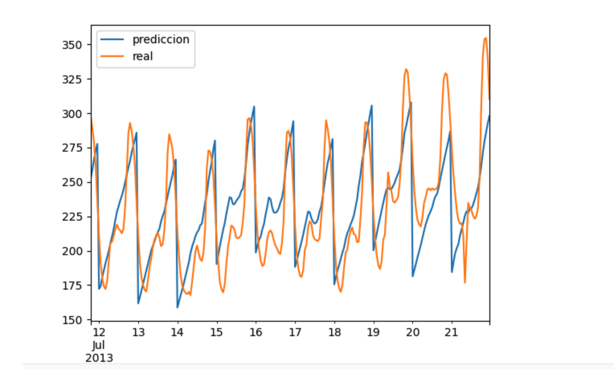

# electric-demand-forecast
Linear Regression Model to Predict Demand
Basically run an algorithm in order to forecast the demand load. The source of the data is from [cammesa](https://portalweb.cammesa.com/) precisely from the province of Corrientes in Argentina between the year 2013 and 2015.
click [here](https://github.com/martinezger/electric-demand-forecast/blob/master/DemandForecast.ipynb) to see the notebook.

